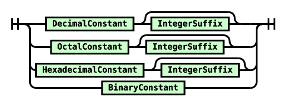
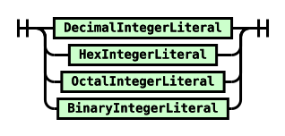
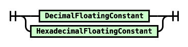
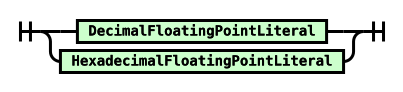

# TP1 — Análise léxica de C e Java 20

**Disciplina:** Linguagens de Programação — PUCRS / Escola Politécnica

**Escopo:** pontos 1, 2 e 3 do Trabalho Prático 1 de 2026/2.

**Integrantes:** a preencher pelo grupo antes da entrega.

**Execução de referência:** ANTLR 4.13.2, JDK 21.0.7, Python 3.12.

## Metodologia e fontes

Preservamos a escolha inicial de **C e Java 20**, as categorias **texto, inteiro e real** e o commit de origem já referenciado no repositório. Estudamos as implementações concretas de [C.g4][c] e [Java20Lexer.g4][java], na revisão `25ad11e4ff672b1eca69d6eeff109ce11bbb663d` de `antlr/grammars-v4`. Esses arquivos de terceiros são a fonte das regras, não código de autoria do grupo. As cópias originais e sua proveniência estão em [vendor](../vendor/README.md).

As gramáticas foram processadas pelo [ANTLR4][antlr], compiladas para Java e executadas sobre entradas individuais. Para cada exemplo, registramos **todos os tokens, seus textos, intervalos, canais, EOF e mensagens do listener de erro**. A análise não invoca parser, compilador C/Java nem avaliação de valores. Reconhecimento léxico não comprova validade sintática, representabilidade numérica, precisão ou compatibilidade integral com a especificação da linguagem.

Adotamos o critério: **aceita pela regra** significa produzir exatamente um token dessa regra, cobrindo toda a entrada, sem erro léxico, seguido de EOF. Um prefixo válido, vários tokens válidos ou texto ignorado não bastam. Índices e colunas são contados a partir de zero; linhas a partir de um.

Em C, `IntegerConstant` e `FloatingConstant` são regras léxicas auxiliares (`fragment`), alternativas independentes dentro de `Constant`; não geram tokens com seus próprios nomes. Para medir cada categoria, geramos uma sonda com `Selected : RegraEstudada;` e as mesmas expressões e dependências, todas como fragmentos. Também executamos o lexer completo, preservado sem alterações. Esse cuidado evita aceitar um real como inteiro só porque ambos aparecem como `Constant`. Em Java, as três regras já emitem tokens distintos. As sondas não contêm regra de descarte nem um token genérico que esconda erros.

Os testes verificam a integridade das fontes e do JAR, 24 casos principais (duas aceitações e duas rejeições por categoria e linguagem) e 22 complementares. Cada caso roda em dois lexers, totalizando **92 execuções**. Os resultados são reproduzíveis com os comandos do [README](../README.md); as evidências completas estão em [RESULTADOS.md](RESULTADOS.md) e [JSON](resultados.json).

## 1. Análise e comparação

### 1.1 Texto — StringLiteral

Em C [1], a regra principal é:

```antlr
StringLiteral : EncodingPrefix? '"' SCharSequence? '"';
```

O prefixo opcional admite `u8`, `u`, `U` ou `L`. `SCharSequence` exige uma ou mais ocorrências de `SChar`, mas a sequência inteira é opcional: a string vazia também pertence à regra. `SChar` admite caracteres comuns exceto aspas, barra invertida, CR e LF; admite escapes e, nesta implementação, continuação por barra seguida de LF ou CRLF. `EscapeSequence` reúne escapes simples, octais, hexadecimais (`\x` seguido de um ou mais hexadecimais) e nomes universais (`\u` com quatro ou `\U` com oito hexadecimais). Restrições semânticas de valores Unicode não são verificadas por esses padrões.

Em Java [2], temos:

```antlr
StringLiteral : '"' StringCharacters? '"';
fragment StringCharacters : StringCharacter+;
fragment StringCharacter : ~["\\\r\n] | EscapeSequence;
```

Não existe prefixo de codificação. São admitidos escapes simples, octais e `UnicodeEscape`. Este último aceita uma ou mais letras `u` antes de quatro dígitos hexadecimais. O próprio arquivo comenta que esse tratamento evita um pré-processamento separado: o comportamento desta gramática não deve ser confundido com todas as fases léxicas prescritas pela [JLS 20, capítulo 3][jls]. A regra também não implementa o escape `\s` presente na especificação Java 20.

Ambas permitem strings vazias e escapes como `\n`; ambas rejeitam LF/CR físicos não escapados. Diferem em prefixos, escapes hexadecimais e continuação de linha. O token preserva o texto de origem: o lexer não converte `\n` em um caractere de nova linha no valor de uma string. Essa interpretação cabe a etapas posteriores.

**Correções da base:** texto literal não é identificador. C não possui, neste arquivo, a alternativa de raw strings sugerida no rascunho. `TextBlock` é outra regra Java, independente de `StringLiteral`, e não conta como exemplo aceito desta categoria. A regra `TextBlock` desta revisão é limitada e não representa todos os blocos de texto da linguagem; não a utilizamos para aceitar strings multilinha.

### 1.2 Inteiros — IntegerConstant e IntegerLiteral

Em C [1]:

```antlr
fragment IntegerConstant
    : DecimalConstant IntegerSuffix?
    | OctalConstant IntegerSuffix?
    | HexadecimalConstant IntegerSuffix?
    | BinaryConstant
    ;
fragment BinaryConstant : '0' [bB] [0-1]+;
```

Decimais começam com dígito de 1 a 9, octais com `0` e hexadecimais com `0x`/`0X`. O zero isolado é abrangido por `OctalConstant`. O sufixo combina `u/U`, `l/L` e `ll/LL` nas ordens definidas por `IntegerSuffix`; `lL` e `Ll` não formam sufixo long long. Não há separadores `_`. Apesar do cabeçalho mencionar C11, **a implementação inclui uma alternativa binária**. Ela não referencia `IntegerSuffix`, portanto `0b1010L` não é reconhecido como um inteiro único por este lexer. Não generalizamos essa particularidade para toda versão de C.

Em Java [2]:

```antlr
IntegerLiteral
    : DecimalIntegerLiteral | HexIntegerLiteral
    | OctalIntegerLiteral | BinaryIntegerLiteral
    ;
fragment IntegerTypeSuffix : [lL];
```

Também existem quatro bases. As produções de dígitos permitem um ou mais `_` internos, exigindo dígitos nas extremidades adequadas. Isso aceita `1__000` e `10_000L`, mas rejeita `12345_` e `0x_FF` como literais inteiros completos. O prefixo octal tem sua própria regra, que permite `_` após o zero inicial. O sufixo opcional é somente `l/L`, inclusive para binários; não existe `U` de unsigned.

O sinal unário não integra a regra de inteiro em nenhum dos dois lexers. Por exemplo, em Java `-12345` vira `SUB` e `IntegerLiteral`. Reconhecer uma longa sequência de dígitos tampouco garante que ela caiba em um tipo numérico.

**Consequência prática:** validação baseada apenas na ausência de erros é insuficiente. Em Java, `01289` vira dois `IntegerLiteral`. Em C, a regra emissora `DigitSequence` pode consumir `01289` integralmente, mesmo que `IntegerConstant` não aceite esse octal. É necessário observar o tipo, a cobertura integral e, no caso de C, o fragmento responsável.

### 1.3 Reais — FloatingConstant e FloatingPointLiteral

Ambas as regras se dividem em alternativas decimal e hexadecimal [1, 2]. Na alternativa decimal de C, exige-se uma parte fracionária com ponto ou uma sequência de dígitos com expoente `e/E`. O expoente tem sinal opcional e ao menos um dígito. O sufixo opcional é `[flFL]`. Em Java, os dígitos podem conter separadores internos e o sufixo é `[fFdD]`. Java também aceita **somente dígitos seguidos de sufixo**, como `12345f`; C não admite essa forma como real nesta gramática.

Nos dois lexers, a forma hexadecimal começa por `0x`/`0X` e exige expoente binário `p/P`, com sinal opcional e dígitos decimais. O ponto pode estar ausente quando o significando é uma sequência hexadecimal, mas o expoente não. Assim, `0x1.Ap+4f` é aceito em ambos, enquanto `0x1.8` não forma um real hexadecimal completo. Java admite separadores nos componentes numéricos por reutilizar seus fragmentos de dígitos; C não.

O sinal inicial de um real também é separado do literal; o sinal **interno ao expoente** pertence à regra. O lexer reconhece a forma textual, sem calcular mantissa, expoente, arredondamento ou overflow. O consumidor dos tokens precisa distinguir sufixos e bases ao interpretar o valor.

| Aspecto | C da revisão escolhida | Java 20 da revisão escolhida |
|---|---|---|
| Strings | Prefixo opcional; escapes `\x`, `\u`, `\U`; continuação de linha | Sem prefixo; Unicode com `u+`; sem `\x` ou continuação |
| Bases inteiras | Decimal, octal, hexadecimal e binária | As mesmas quatro bases |
| Separadores numéricos | Sem `_` | `_` interno, inclusive repetido |
| Sufixos inteiros | Unsigned/long/long long; binário sem sufixo neste arquivo | Somente `l/L` |
| Sufixos reais | `f/F/l/L` | `f/F/d/D` |
| Real apenas com dígitos e sufixo | Não | Sim |
| Real hexadecimal | Expoente `p/P` obrigatório | Expoente `p/P` obrigatório |
| Token numérico emitido | `Constant` para inteiro e real | Tipos distintos para inteiro e real |

## 2. Demonstração de entradas

As tabelas seguintes apresentam os **24 exemplos principais**, todos com pelo menos cinco caracteres. Os textos das entradas são os caracteres fornecidos ao lexer: por exemplo, `\n` nas tabelas representa barra e letra n. Todos os fluxos terminam em EOF. **“Rejeitada” refere-se à regra estudada e à entrada inteira**, não necessariamente a um erro de reconhecimento do lexer completo.

<!-- TABELAS_INICIO -->

### C — StringLiteral

| ID | Entrada | Resultado | Tokens do lexer completo (antes de EOF) | Erros léxicos | Explicação |
|---|---|---|---|---|---|
| C01 | `u8"Olá, mundo!"` | Aceita | `StringLiteral` (`u8"Olá, mundo!"`) | 0 | Prefixo u8 permitido antes das aspas. |
| C02 | `"linha\x41"` | Aceita | `StringLiteral` (`"linha\x41"`) | 0 | Escape hexadecimal com um ou mais dígitos hexadecimais. |
| C03 | `"texto\q"` | Rejeitada | nenhum | 2 | Não existe escape \q: o lexer informa erro léxico. |
| C04 | `"sem fechamento` | Rejeitada | nenhum | 1 | Falta a aspa final: nenhum literal completo. |

### C — IntegerConstant

| ID | Entrada | Resultado | Tokens do lexer completo (antes de EOF) | Erros léxicos | Explicação |
|---|---|---|---|---|---|
| C09 | `0xCAFEuLL` | Aceita | `Constant` (`0xCAFEuLL`) | 0 | Inteiro hexadecimal com sufixo unsigned long long. |
| C10 | `0b101101` | Aceita | `Constant` (`0b101101`) | 0 | Esta versão do lexer C inclui explicitamente BinaryConstant. |
| C11 | `10_000` | Rejeitada | `Constant` (`10`); `Identifier` (`_000`) | 0 | Sublinhado não pertence aos numerais desta gramática C. |
| C12 | `12345lL` | Rejeitada | `Constant` (`12345l`); `Identifier` (`L`) | 0 | LongLongSuffix admite ll ou LL, não a mistura lL. |

### C — FloatingConstant

| ID | Entrada | Resultado | Tokens do lexer completo (antes de EOF) | Erros léxicos | Explicação |
|---|---|---|---|---|---|
| C17 | `12.50e-03L` | Aceita | `Constant` (`12.50e-03L`) | 0 | Fração decimal, expoente com sinal e sufixo long double. |
| C18 | `0x1.Ap+4f` | Aceita | `Constant` (`0x1.Ap+4f`) | 0 | Real hexadecimal exige expoente binário p/P; aceita sufixo f. |
| C19 | `10_000.50` | Rejeitada | `Constant` (`10`); `Identifier` (`_000`); `Constant` (`.50`) | 0 | Sublinhado divide a entrada em Constant, Identifier e Constant. |
| C20 | `12.5e+` | Rejeitada | `Constant` (`12.5`); `Identifier` (`e`); `Plus` (`+`) | 0 | O expoente precisa de dígitos após o sinal; a entrada é tokenizada em partes. |

### Java — StringLiteral

| ID | Entrada | Resultado | Tokens do lexer completo (antes de EOF) | Erros léxicos | Explicação |
|---|---|---|---|---|---|
| J05 | `"Olá\nmundo"` | Aceita | `StringLiteral` (`"Olá\nmundo"`) | 0 | A sequência barra+n é um escape permitido, não uma quebra física de linha. |
| J06 | `"valor\u0041"` | Aceita | `StringLiteral` (`"valor\u0041"`) | 0 | A gramática inclui UnicodeEscape no próprio lexer. |
| J07 | `u8"texto"` | Rejeitada | `Identifier` (`u8`); `StringLiteral` (`"texto"`) | 0 | O prefixo vira Identifier e o restante StringLiteral; não há um único literal. |
| J08 | `"texto\x41"` | Rejeitada | `IntegerLiteral` (`41`) | 2 | Escape hexadecimal \x não é alternativa desta regra Java. |

### Java — IntegerLiteral

| ID | Entrada | Resultado | Tokens do lexer completo (antes de EOF) | Erros léxicos | Explicação |
|---|---|---|---|---|---|
| J13 | `10_000L` | Aceita | `IntegerLiteral` (`10_000L`) | 0 | Separador interno entre dígitos e sufixo long. |
| J14 | `0b1010_0101` | Aceita | `IntegerLiteral` (`0b1010_0101`) | 0 | Base binária com separador interno. |
| J15 | `12345UL` | Rejeitada | `IntegerLiteral` (`12345`); `Identifier` (`UL`) | 0 | Java não possui sufixo unsigned; UL vira Identifier. |
| J16 | `01289` | Rejeitada | `IntegerLiteral` (`012`); `IntegerLiteral` (`89`) | 0 | O prefixo octal 012 e o decimal 89 viram tokens separados. |

### Java — FloatingPointLiteral

| ID | Entrada | Resultado | Tokens do lexer completo (antes de EOF) | Erros léxicos | Explicação |
|---|---|---|---|---|---|
| J21 | `10_000.50D` | Aceita | `FloatingPointLiteral` (`10_000.50D`) | 0 | Separador interno e sufixo double aceitos. |
| J22 | `0x1.Ap+4f` | Aceita | `FloatingPointLiteral` (`0x1.Ap+4f`) | 0 | Mesma estrutura hexadecimal de C neste exemplo. |
| J23 | `12.50L` | Rejeitada | `FloatingPointLiteral` (`12.50`); `Identifier` (`L`) | 0 | L é sufixo inteiro, não sufixo de ponto flutuante Java. |
| J24 | `0x1.8` | Rejeitada | `IntegerLiteral` (`0x1`); `FloatingPointLiteral` (`.8`) | 0 | Falta o expoente binário obrigatório p/P. |

<!-- TABELAS_FIM -->

Os IDs das tabelas correspondem às seções de [RESULTADOS.md](RESULTADOS.md). Esse arquivo inclui as mensagens literais do ANTLR, todos os lexemas e os resultados das sondas isoladas, não apenas um resumo de aceitação.

### Efeito das abordagens no reconhecimento

As regras aplicam o reconhecimento mais longo possível; em empates, a ordem das regras resolve a escolha do token. Isso explica por que a recuperação de um texto inválido pode produzir outros tokens válidos. Em Java, `u8"texto"` não gera erro léxico: gera um identificador seguido de string. Em C, `10_000.50` gera um inteiro, um identificador e um real, todos sob tipos válidos. Nenhuma dessas sequências representa um único literal da categoria testada.

`12.5e+` em C ilustra um expoente incompleto: o lexer ainda reconhece `12.5`, `e` e `+`. Já `"texto\q"` contém um escape que impede a formação do token e produz mensagens de reconhecimento. As duas formas de rejeição exigem explicações diferentes.

Os 22 casos complementares verificam fronteiras úteis: sufixo binário de C, dígitos com sufixo real em Java, `_` nas extremidades, sublinhados repetidos, sinais, nomes universais, raw string ausente e quebras físicas de linha. Também verificam espaços e comentários: Java descarta `WS`, enquanto C coloca espaços em canal oculto. O critério de cobertura integral impede que `12345 ` seja apresentado como um literal exato em qualquer dos dois.

## 3. Diagramas de sintaxe

As seis imagens a seguir foram geradas automaticamente com [railroad-diagrams][railroad] a partir dos corpos das regras, sem reescrever manualmente sua lógica. Leia cada ferrovia da esquerda para a direita: bifurcações indicam alternativas, caminhos de desvio indicam opcionalidade e retornos indicam repetição. Caixas arredondadas representam literais ou conjuntos de caracteres; caixas retangulares referenciam regras auxiliares. `~[...]` é o complemento de um conjunto.

As imagens principais preservam a decomposição da gramática. O [atlas HTML](diagramas/atlas.html), aberto localmente no navegador, apresenta **todas as dependências transitivas** em diagramas próprios e as expressões ANTLR correspondentes. Clique nas referências para seguir a expansão. Assim, os nomes dos fragmentos não escondem os detalhes dos numerais ou escapes.

### 3.1 Texto


O desvio inicial de C torna visível o prefixo opcional de codificação. Em ambos, um segundo desvio permite conteúdo vazio entre as aspas. A diferença nos escapes aparece ao expandir `SChar` e `StringCharacter` no atlas: C acrescenta os ramos de continuação de linha, e sua árvore de escapes inclui hexadecimal e nomes universais. A ausência desses ramos em Java ajuda a explicar as rejeições da seção 2.

### 3.2 Inteiros





Ambos mostram quatro alternativas de base. Em C, os três primeiros caminhos passam pelo sufixo opcional; o caminho binário não passa por ele. Em Java, os sufixos ficam dentro de cada fragmento de base. A aparente simplicidade da figura principal Java decorre dessa decomposição, não de um conjunto menor de formatos. No atlas, os retornos sobre `DigitOrUnderscore` e equivalentes revelam a repetição de separadores, enquanto a exigência de um dígito no fim impede o `_` final.

### 3.3 Reais





As duas figuras principais têm a mesma forma: uma escolha entre decimal e hexadecimal. Os detalhes estão nas expansões. `DecimalFloatingPointLiteral` Java tem quatro caminhos, incluindo `Digits FloatTypeSuffix`; `DecimalFloatingConstant` C possui duas alternativas e exige ponto ou expoente. Nos caminhos hexadecimais, não existe desvio que permita omitir o expoente binário: essa obrigatoriedade explica a rejeição de `0x1.8`. Os diferentes conjuntos de sufixos também ficam explícitos em seus diagramas auxiliares.

### Conclusões

A comparação mostra que implementações com a mesma categoria de literal diferem em prefixos, separadores, escapes e sufixos. A estrutura comum dos diagramas principais não garante equivalência: é necessário seguir as dependências. O experimento ainda evidencia que tokenizar sem erros e reconhecer um literal inteiro são critérios diferentes. Conservar as gramáticas originais, testar seus fragmentos e registrar o fluxo completo permite explicar essas diferenças sem atribuir ao lexer validações sintáticas ou semânticas que ele não realiza.

## Referências

1. [ANTLR grammars-v4 — gramática C na revisão utilizada][c]. Fonte de todas as regras C, incluindo os fragmentos numéricos.
2. [ANTLR grammars-v4 — Java20Lexer na revisão utilizada][java]. Fonte de todas as regras Java analisadas.
3. [ANTLR — distribuição da ferramenta][antlr]. Execução fixada em 4.13.2; hash verificado pelo script.
4. [Java Language Specification, Java SE 20 — Lexical Structure][jls]. Referência complementar para distinguir linguagem e implementação.
5. [Tab Atkins — railroad-diagrams][railroad]. Gerador dos SVGs, versão Python 3.0.1.
6. PUCRS / Escola Politécnica. *Trabalho Prático 1 (TP1) — Lexer*, 2026/2. Enunciado fornecido pelo solicitante, arquivo `t-pratico1-lexers-2026-2.pdf`, duas páginas.

[c]: https://github.com/antlr/grammars-v4/blob/25ad11e4ff672b1eca69d6eeff109ce11bbb663d/c/C.g4
[java]: https://github.com/antlr/grammars-v4/blob/25ad11e4ff672b1eca69d6eeff109ce11bbb663d/java/java20/Java20Lexer.g4
[antlr]: https://www.antlr.org/download.html
[jls]: https://docs.oracle.com/javase/specs/jls/se20/html/jls-3.html
[railroad]: https://github.com/tabatkins/railroad-diagrams
